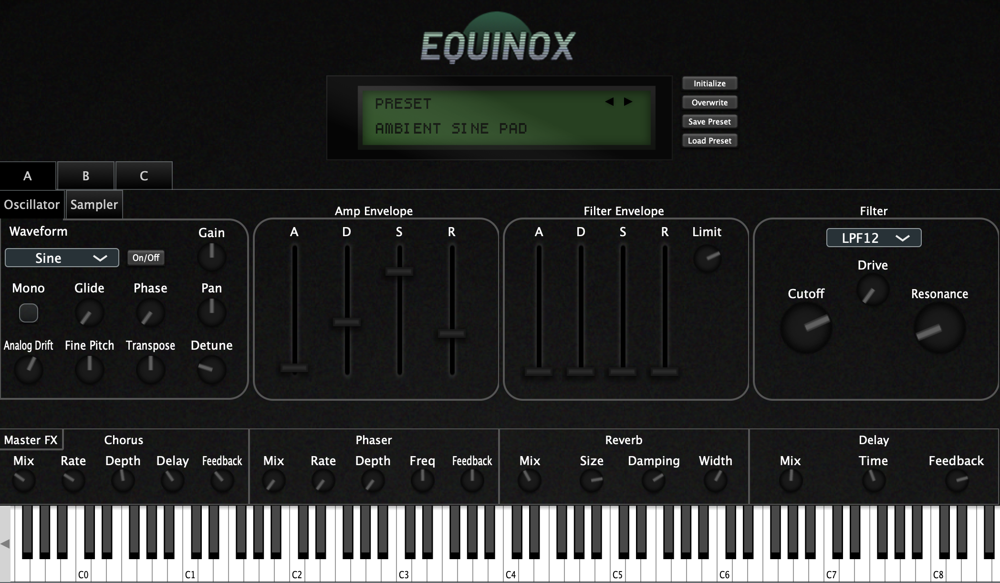

# This Fork Readme
In this fork, at the moment, only a few changes have been made to the CMakeLists.txt and a build for Windows has been made.

# Original repository Readme

# Equinox

Equinox is a synthesizer plugin built with [JUCE](https://juce.com/). It combines three independent synth layers, a master FX section, and a small factory preset library in one instrument.



## Features

Three independent synth layers with:
- 16-voice polyphony each
- Band-limited dual-oscillator with classic waveforms (sine, triangle, saw, square) and white noise
- Sampler for loading and playing back audio files
- Common voice controls: gain, pan, fine pitch, transpose, detune, and phase (start time for samples)
- Analog drift for per-voice random pitch and phase variation
- Monophonic voice mode with adjustable portamento glide time
- Per-voice ADSR amp and filter envelopes
- Ladder filter with 12 and 24 dB/octave low-pass and high-pass modes

A master FX section with:
- Chorus
- Phaser
- Reverb
- Delay

And a preset menu for browsing, loading, and saving presets.

## Factory Presets

Factory presets are bundled into the plugin binary from [`resources/presets`](resources/presets).

On first launch, Equinox creates the preset directory at:

```text
~/Documents/Equinox/Presets
```

and seeds the bundled factory presets there when that folder is created.

## Installation

The easiest way to install Equinox is from the GitHub release zip:

- `Equinox-macOS-v1.2.0.zip`

The release archive contains:

- `AU/Equinox.component`
- `VST3/Equinox.vst3`
- `Standalone/Equinox.app`

### macOS Install

1. Download the latest release zip from the repository's Releases page.
2. Unzip it.
3. Install whichever formats you want:

- Audio Unit:
  copy `Equinox.component` to `~/Library/Audio/Plug-Ins/Components` or `/Library/Audio/Plug-Ins/Components` for system-wide installation
- VST3:
  copy `Equinox.vst3` to `~/Library/Audio/Plug-Ins/VST3` or `/Library/Audio/Plug-Ins/VST3` for system-wide installation
- Standalone:
  move `Equinox.app` wherever you want, for example `/Applications`

4. Launch your DAW or restart plugin scanning if needed.

If macOS blocks the plugin from running because it's from an unidentified developer, you can allow it in System Preferences > Privacy & Security > Security, where there should be an option to allow the plugin to run.

## Build From Source

### Requirements

- macOS (Not tested on Windows or Linux yet, but should be easily portable)
- JUCE `8.0.12+` (included as a submodule in `lib/JUCE`)
- CMake `3.24+`
- C++20 compatible compiler

### Clone And Build

```bash
git clone <repo-url>
cd Equinox
git submodule update --init --recursive
cmake -S . -B build
cmake --build build
```

By default, the main plugin target builds:

- `AU`
- `VST3`
- `Standalone`

## Run Tests

In addition to the main plugin targets, there is a test target `EquinoxCoreTests` that builds and runs unit tests for core non-audio code such as parameter management and preset loading. To build and run the tests, set `EQUINOX_BUILD_TESTS=ON` in the CMakeLists.txt or pass it as a command-line option when configuring CMake:

```bash
cmake -S . -B build -DEQUINOX_BUILD_TESTS=ON
cmake --build build --target EquinoxCoreTests
ctest --test-dir build --output-on-failure
```

## Project Layout

The codebase is organized by subsystem under `src/`:

- `src/state`
  parameter IDs, typed parameter references, plugin state, preset management, sample state
- `src/synth`
  synth engine, voices, and DSP
- `src/fx`
  master effect processors and chain
- `src/gui`
  reusable components and editor panels
- `src/utils`
  utility runtime helpers such as output protection

Bundled assets live under `resources/`:

- `resources/graphics`
- `resources/fonts`
- `resources/presets`

Tests live under `tests/`.

## License

Equinox is licensed under the terms of the GNU General Public License v3.0. See [`LICENSE`](LICENSE) for details.
